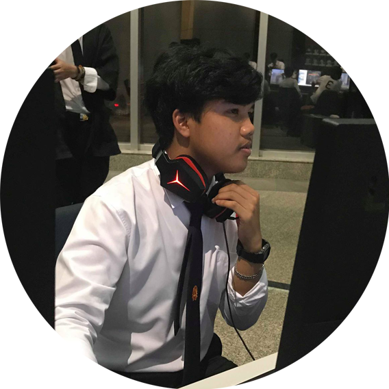

<h2>|PROJECT PROBLEM SOLVING IN INFORMATION TECHNOLOGY|</h2>
 
<h2>Bitcoin Price over the years 2017-2018</h2>
<h2>✪ Explain</h2>
&nbsp;&nbsp;&nbsp;&nbsp;&nbsp;&nbsp;&nbsp;&nbsp;ศึกษาพฤติกรรมของราคาบิตคอยน์ตั้งเเต่ May 2017 จนถึง May 2018 เเละหาสาเหตุการพุ่งขึ้นของราคาบิตคอยน์ อีกทั้งหาผลกระทบที่ราคาบิตคอยน์มีผลต่ออุสาหกรรมอื่นๆ โดนการเลือกใช้ภาษา python ในการเขียนโปรแกรมคำนวณ

ข้อมูล : ไฟล์ .csv ประกอบด้วย
 - Ranking : อันดับของ bitcoin นั้นๆ
 - Name : ชื่อของ bitcoin 
 - Symbol : สัญลักษณ์หรือชื่ออยู่ของ bitcoin
 - Market Capital : มูลค่าตามราคาตลาด ไม่ว่าจะเป็นมูลค่ารวมของหุ้นรายตัว มูลค่ารวมรายอุตสาหกรรม
 - Price : จำนวนเงินที่บุคคลต้องจ่ายเพื่อตอบแทนกับการได้รักรรมสิทธิ์
 - Transaction : การติดต่อซื้อขาย
 - Volume : หน่วยของการถือครองราคาคิดออกมาเป็น มูลค่า ซึ่งโวลุ่มนั้นมักเกิดขึ้นจากราคาเสนอซื้อ และราคาเสนอขาย
 
 <h2>✪ Bitcoin คือ?</h2>
 &nbsp;&nbsp;&nbsp;&nbsp;&nbsp;&nbsp;&nbsp;&nbsp;Bitcoin อ่านว่าบิทคอยน์ คือสกุลเงินในรูปแบบของดิจิทัล ถูกสร้างขึ้นมาด้วยภาษาคอมพิวเตอร์ ไม่มีใครเป็นเจ้าของ Bitcoin ไม่มีรูปร่างและไม่สามารถจับต้องได้เหมือนธนบัตรหรือเหรียญเงินบาท Bitcoin ถูกสร้างขึ้นมาด้วยกลุ่มนักพัฒนาเล็กๆกลุ่มหนึ่งตลอดจนบริษัทใหญ่ๆทั่วโลก โดยระบบของ Bitcoin ถูกรันโดยคอมพิวเตอร์ของผู้ใช้งานทั่วโลก โดยใช้ระบบซอฟต์แวร์ในการถอดสมการคณิตศาสตร์

นักพัฒนาด้านซอฟต์แวร์ผู้ใช้นามแฝงว่า ซาโตชิ นาคาโมโตะ เป็นผู้พัฒนา Bitcoin ขึ้นมาซึ่งเป็นระบบจ่ายเงินที่อ้างอิงอยู่บนการถอดสมการคณิตศาสตร์ โดยจุดประสงค์ของเขาคือการสร้างสกุลเงินที่เป็นอิสระจากรัฐบาลและธนาคาร, สามารถส่งหากันผ่านระบบอินเทอร์เนตและมีค่าธรรมเนียมที่ถูกมากๆ

# ☀ Member

&nbsp;&nbsp;&nbsp;&nbsp;&nbsp;&nbsp;&nbsp;&nbsp;&nbsp;&nbsp;&nbsp;&nbsp;&nbsp;&nbsp;&nbsp;&nbsp;&nbsp;&nbsp;&nbsp;&nbsp;&nbsp;&nbsp;&nbsp;&nbsp; &nbsp;&nbsp;&nbsp;&nbsp;&nbsp;&nbsp;&nbsp;&nbsp;&nbsp;&nbsp;&nbsp;&nbsp;&nbsp;&nbsp;&nbsp;&nbsp; &nbsp;&nbsp;&nbsp;&nbsp;&nbsp;&nbsp;&nbsp;&nbsp;&nbsp;&nbsp;&nbsp;&nbsp;&nbsp;&nbsp;&nbsp;&nbsp; &nbsp;&nbsp;&nbsp;&nbsp;&nbsp;&nbsp;&nbsp;&nbsp;&nbsp;&nbsp;&nbsp;&nbsp;&nbsp;&nbsp;&nbsp;&nbsp;

&nbsp;&nbsp;&nbsp;&nbsp;&nbsp;&nbsp;&nbsp;&nbsp;&nbsp;&nbsp;&nbsp;&nbsp;&nbsp;&nbsp;&nbsp;&nbsp;&nbsp;&nbsp;&nbsp;&nbsp;&nbsp;&nbsp;&nbsp;&nbsp;&nbsp;&nbsp;&nbsp;&nbsp;61070060 &nbsp;&nbsp;&nbsp;&nbsp;&nbsp;&nbsp;&nbsp;&nbsp;&nbsp;&nbsp;&nbsp;&nbsp;&nbsp;&nbsp;&nbsp;&nbsp;&nbsp;&nbsp;&nbsp;&nbsp;&nbsp;&nbsp;&nbsp;61070203 &nbsp;&nbsp;&nbsp;&nbsp;&nbsp;&nbsp;&nbsp;&nbsp;&nbsp;&nbsp;&nbsp;&nbsp;&nbsp;&nbsp;&nbsp;&nbsp;&nbsp;&nbsp;&nbsp;&nbsp;&nbsp;&nbsp;&nbsp;61070238  &nbsp;&nbsp;&nbsp;&nbsp;&nbsp;&nbsp;&nbsp;&nbsp;&nbsp;&nbsp;&nbsp;&nbsp;&nbsp;&nbsp;&nbsp;&nbsp;&nbsp;&nbsp;&nbsp;&nbsp;&nbsp;&nbsp;&nbsp;61070245

